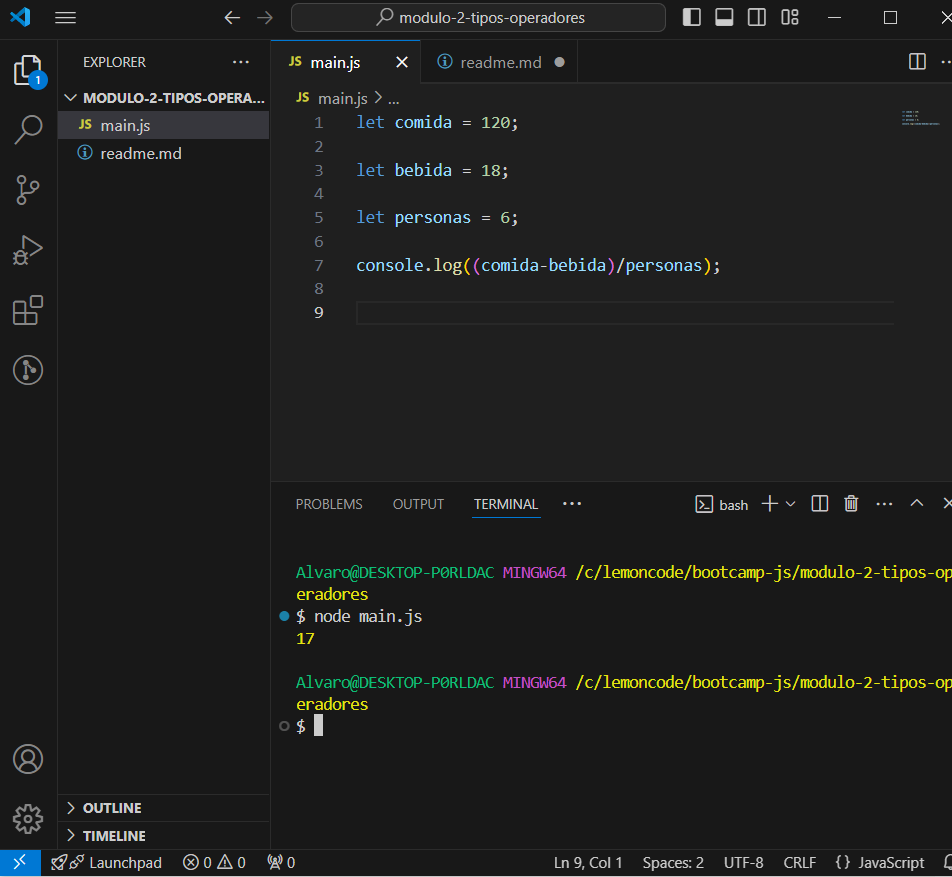

Con el siguiente código se ha calculado el costo equitativo que debería pagar cada comensal:

Cada comensal debería pagar 17 euros,entre los 6 suman 102 más 18 de las bebidas tenemos el total del ticket.

Ejecutar el comando "npm run dev" tras instalar dependencias para iniciar el servidor local, después en las herramientas de desarrollador
podemos ver el resultado en consola.