Se ha creado e inicializado un nuevo repositorio utilizando el terminal gitbash:
  
  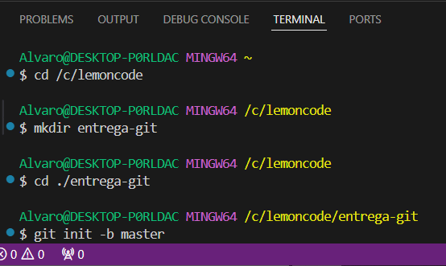

Seguidamente se ha creado un nuevo repositorio en Github y conectado éste con nuestro repositorio local:

  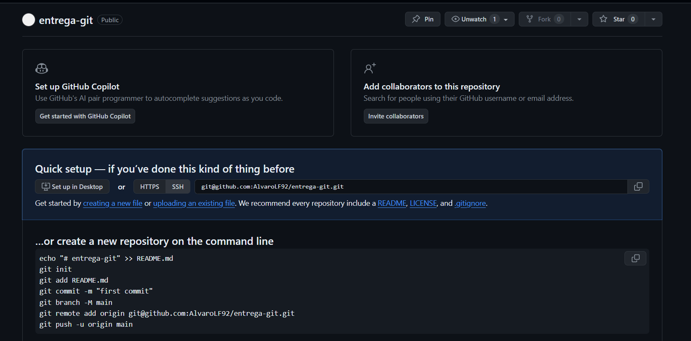

  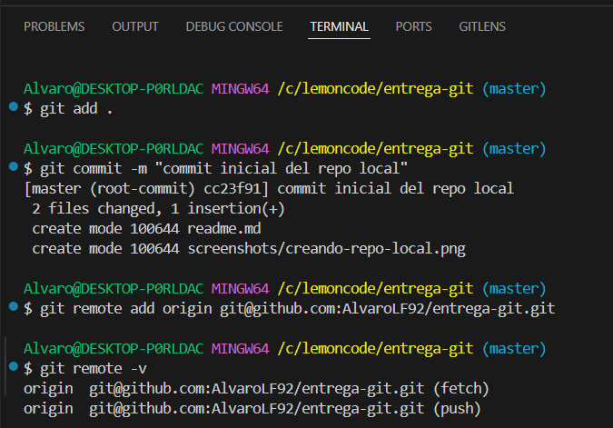

  He perdido la información de la consola por hacer un "clear" sin sacar la captura del momento en que subí los cambios en local al repo de github,
  utilizando el comando "git push origin master" ( al inicializar el proyecto especifiqué el nombre de la rama principal,cambiando el "main" por defecto por master):

  A continuacion comprobé que todos los cambios estaban subidos en Github correctamente:

  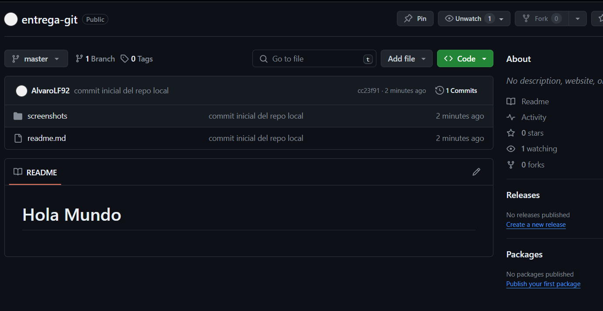

  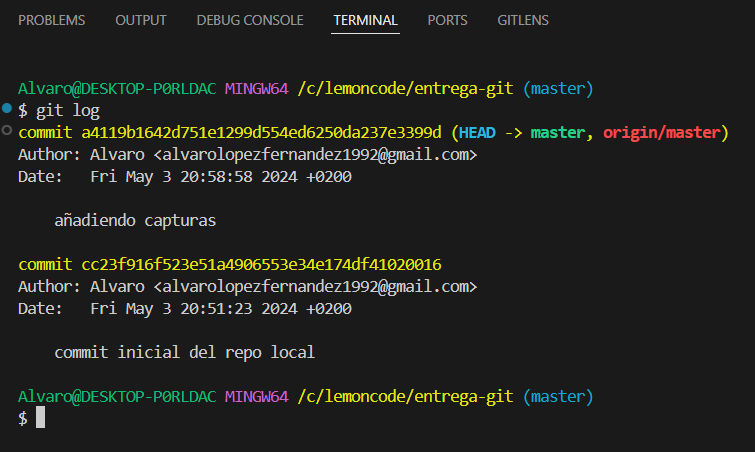

  Se ha creado un nuevo archivo "fichero.txt" y añadido los cambios al staging. Seguidamente se ha realizado un commit indicando dicho cambio
  junto a otras modificaciones del proyecto:
  
  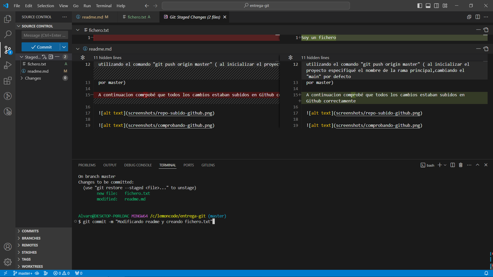

  Una vez comprobado que los cambios eran correctos se ha realizado un push al repo de github:

  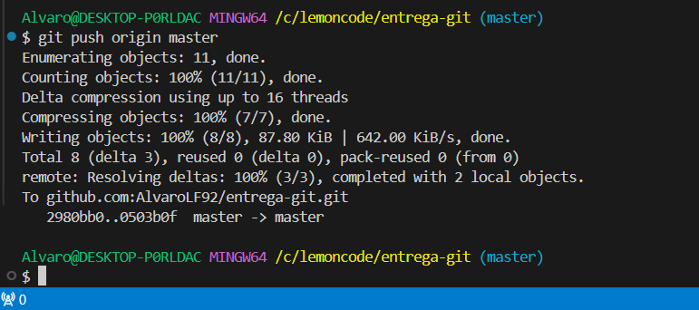

  Se ha creado una nueva rama "development" y se han realizado cambios en el fichero.txt desde la misma:
  
  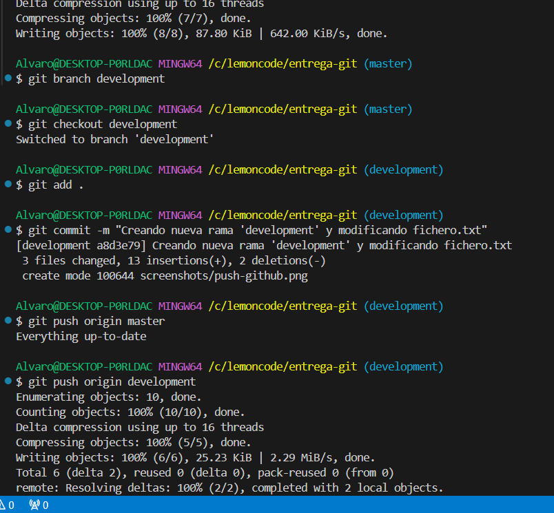

  Comprobación de git log:

  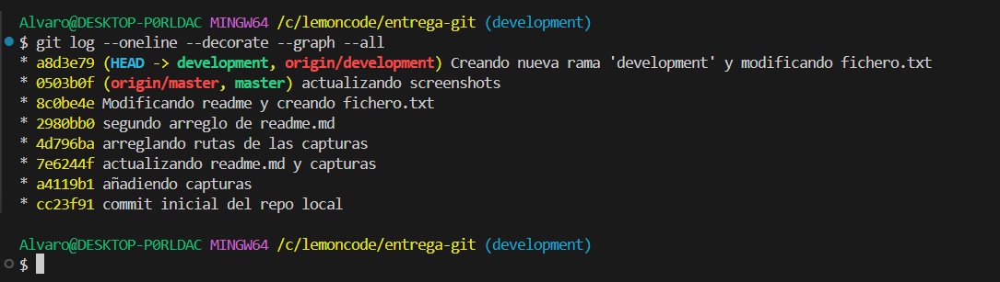

  Se ha realizado un merge de la rama development a la rama máster y se ha especificado en un commit.

  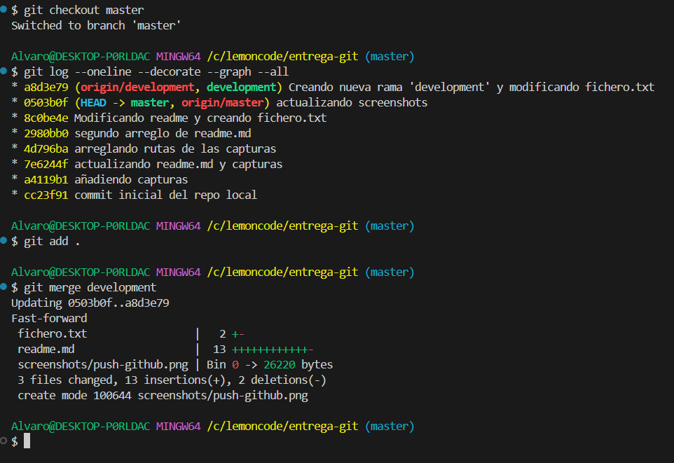

  Por último se han subido los cambios al repo de Github:

  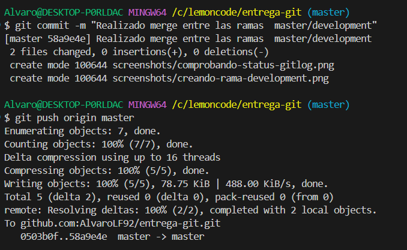