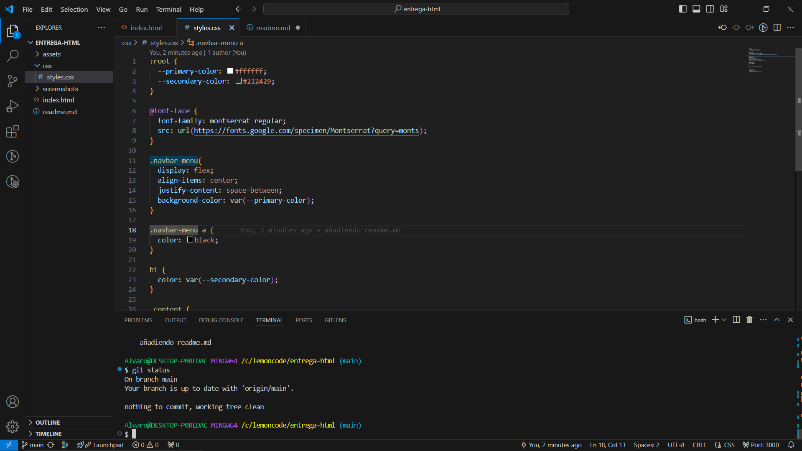
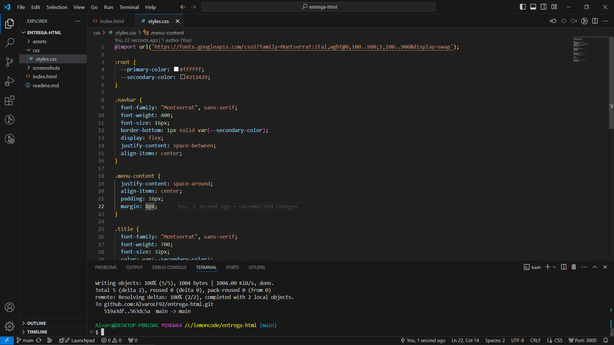
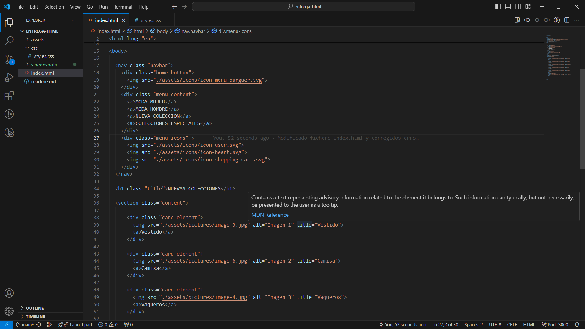
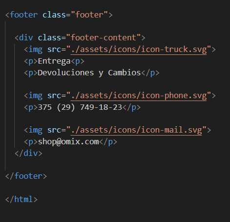
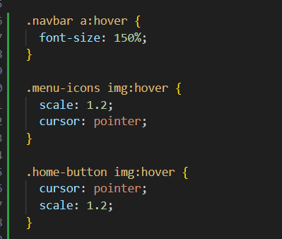
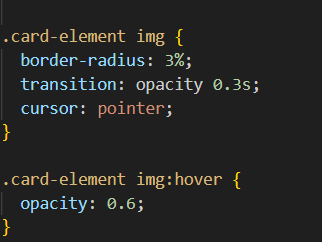
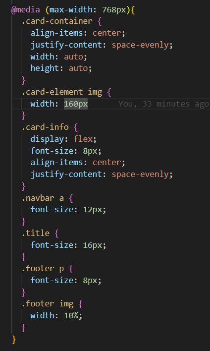

Se ha creado un repositorio local y la estructura base del proyecto. 

Se ha creado una estructura inicial con html y añadido la hoja de estilos,se han introducido algunas propiedades para comprobar que tanto los recursos como los estilos se aplican correctamente.

Posteriormente se porcederá a realizar el maquetado final y algunos extras con CSS.

Se ha terminado la estructura de la página incluyendo el footer.

Se han dado los estilos finales y añadido pequeños efectos con "hover".

Añadidos estilos para pantallas pequeñas tratando de optimizar el comportamiento responsive de la página.

